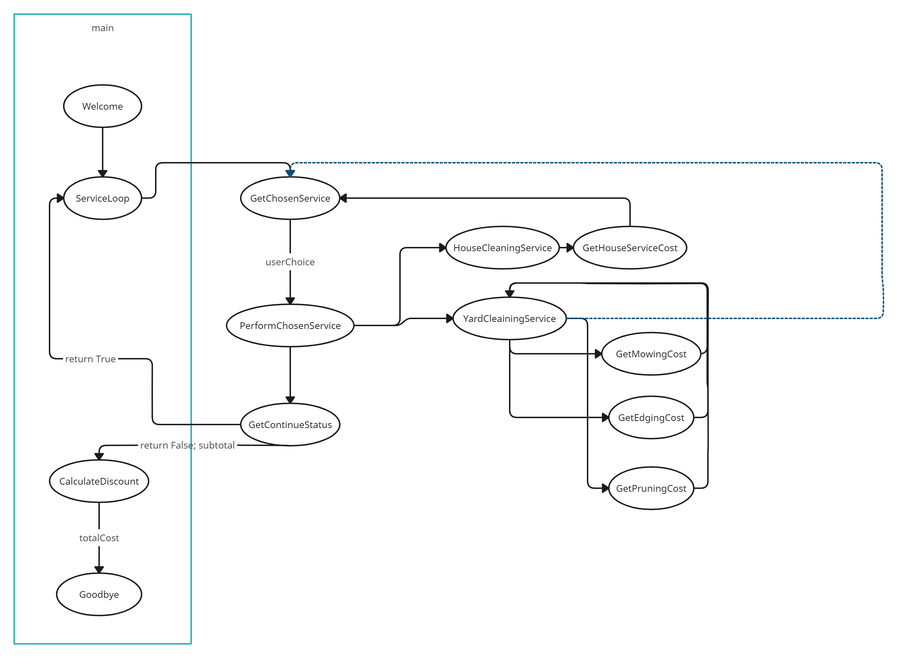

# CMIS 102 Final Project: House and Yard Cleaning Services
My final program for this class implements house cleaning and yard cleaning services that the user can select from in a loop. The subtotal is calculated as the program goes on. Once the user is finished, they are prompted for their age. If the user is above a specified age, a senior discount is applied. The program then tells the user their total cost and the program ends.
This program is broken up into functions that perform different roles. The main function calls these functions in a way where the only variable being passed throughout is the running cost. A diagram of the program flow is seen int the image below, with functions directly called by main() in the blue box:

